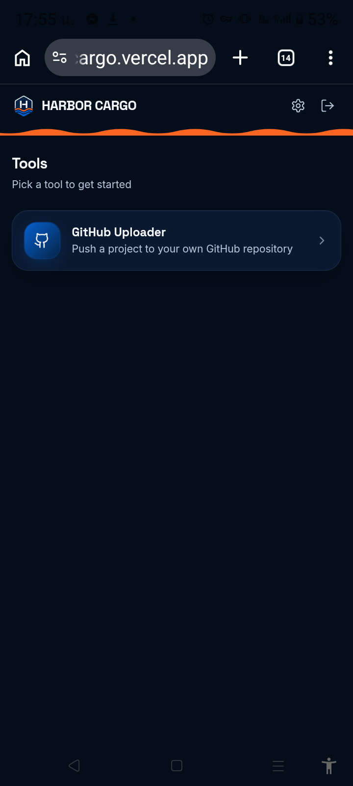
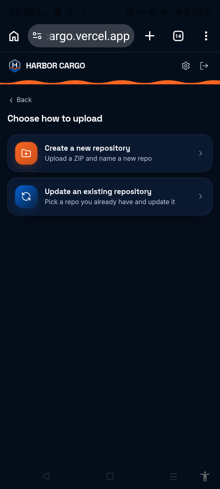
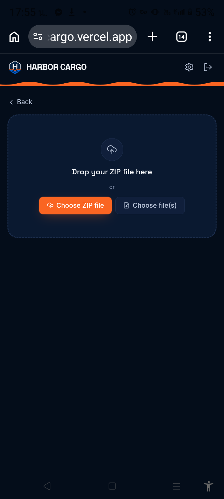
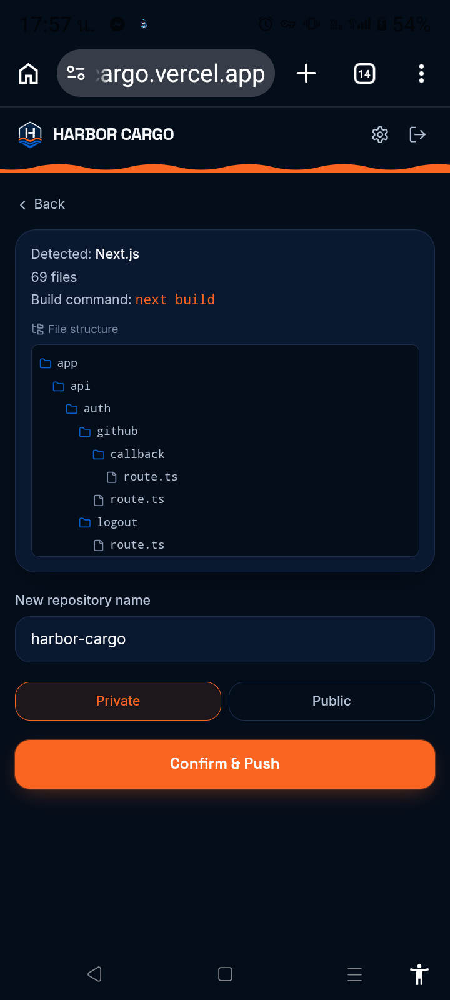
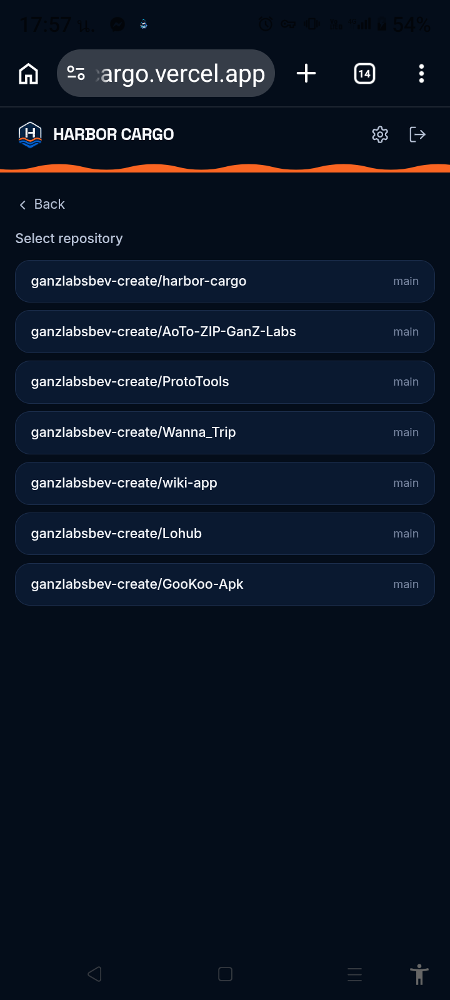
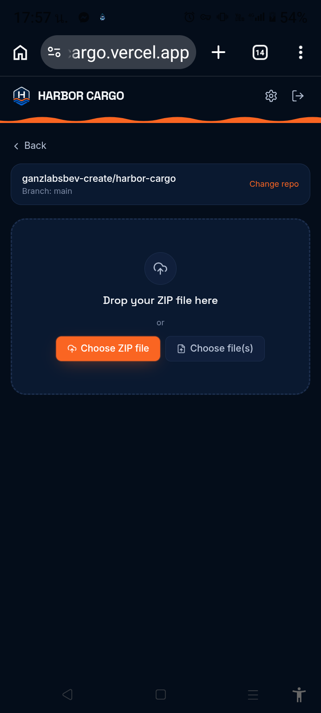
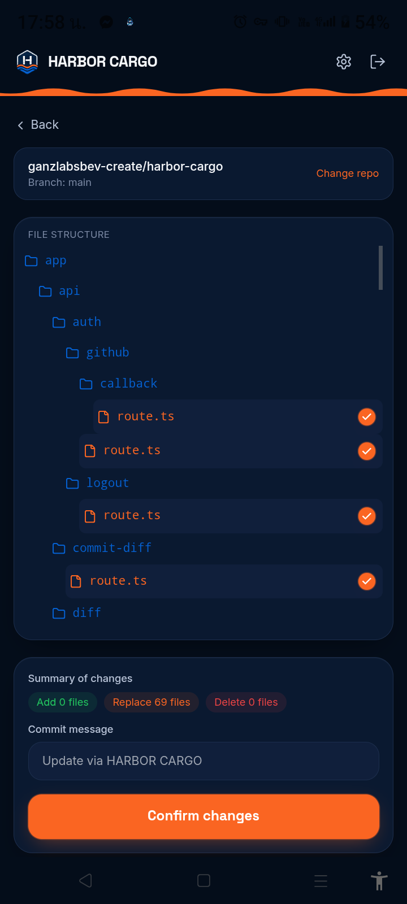

# HARBOR CARGO 

### Build on mobile. Ship to GitHub.

HARBOR CARGO is a mobile-first tool for moving your projects to GitHub.

Choose a project, select where it goes, and let HARBOR handle the delivery.

**Create a new repository or update an existing one — directly from your device.**

[Open HARBOR CARGO](https://harbor-cargo.vercel.app/)

---

## What is HARBOR CARGO?

HARBOR CARGO is a hub for project delivery tools.

The first available tool is **GitHub**, allowing you to:

- Create a new GitHub repository from your project
- Update an existing GitHub repository
- Upload ZIP files or loose files
- Review your project before sending it
- Compare project files with an existing repository
- Choose which files to add, replace, or delete

More tools and destinations may be added in future versions.

---

# 🚀 Create a New Repository

Create a new GitHub repository from your project.

### 1. Choose GitHub

Open HARBOR CARGO and choose the GitHub tool.



### 2. Choose Create Repository

Choose **Create a new repository**.



### 3. Select Your Project

Choose a ZIP file or select project files directly from your device.

HARBOR analyzes the project and shows its file structure before creating the repository.



### 4. Configure and Create

Enter your repository name and choose whether the repository should be **Private** or **Public**.

Review the project, then confirm.



Your new repository will be created on GitHub.

---

# 🔄 Update an Existing Repository

Already have a project on GitHub?

Use HARBOR to compare your local project with an existing repository and choose exactly which changes should be sent.

### 1. Choose GitHub

Open HARBOR CARGO and choose the GitHub tool.


### 2. Choose Update Repository

Choose **Update an existing repository**.


### 3. Select a Repository

Choose the GitHub repository you want to update.



### 4. Import Your Project

Upload a ZIP file or select project files directly from your device.

HARBOR compares the uploaded project with the selected repository.



### 5. Review and Confirm Changes

HARBOR shows the differences between your project and the repository.

You can choose which files to:

- **Add** — add new files
- **Replace** — replace existing files
- **Delete** — remove files from the repository

Review your selections, optionally add a commit message, and confirm the update.



Your selected changes will be committed to GitHub.

---

# 🔐 GitHub & Your Data

HARBOR CARGO connects to GitHub using your own GitHub account.

You remain in control of your GitHub repositories and the projects you send through HARBOR.

HARBOR does not claim ownership of your project files or their contents.

For more information about how HARBOR handles information and sessions, see:

- [Privacy Policy](https://harbor-cargo.vercel.app/settings/privacy)
- [License](https://harbor-cargo.vercel.app/settings/license)

---

# ⚠️ Before Using HARBOR

You need:

- A GitHub account
- Permission to access the repository you want to use
- A project or project files to upload

When updating a repository, HARBOR needs permission to make changes to that repository through your GitHub account.

---

# 🐛 Report a Problem

Found something that doesn't work?

Please [open an issue](https://github.com/ganzlabsbev-create/harbor-cargo/issues) and include:

- What you were trying to do
- What happened
- The error message, if one was shown
- Your device and browser

**Never include passwords, GitHub access tokens, or other private credentials in an issue.**

---

# 🛠️ Developers

HARBOR CARGO is developed by **GanZ Labs**.

The information below is intended for developers working with the project source code.

## Local Development

```bash
npm install
npm run dev
```

Create your local environment file from `.env.example` and configure the required services and credentials.

## Environment Variables

| Variable | Purpose |
|---|---|
| `GITHUB_OAUTH_CLIENT_ID` | GitHub OAuth application client ID |
| `GITHUB_OAUTH_CLIENT_SECRET` | GitHub OAuth application secret |
| `SESSION_ENCRYPTION_KEY` | Encryption key used for user sessions |
| `POSTGRES_URL` | PostgreSQL database connection |
| `BLOB_READ_WRITE_TOKEN` | Vercel Blob storage access |
| `NEXT_PUBLIC_BUILD_ID` | Build identifier generated during the build |

## GitHub OAuth

For a self-hosted installation, create a GitHub OAuth App and configure:

- **Homepage URL:** your deployed HARBOR URL
- **Authorization callback URL:**

```
https://<your-domain>/api/auth/github/callback
```

---

# 📜 License

HARBOR CARGO is proprietary software developed by GanZ Labs.

See the [License](https://harbor-cargo.vercel.app/settings/license) page for the terms that apply to the software.

---

### About

**HARBOR CARGO**
Built by GanZ Labs
Build on mobile. Ship to GitHub.
